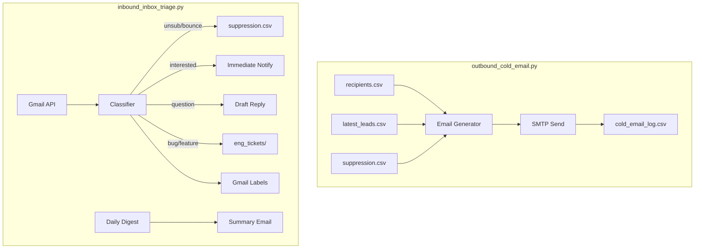

# OSHA Cold Email & Inbox Triage Automation

Two production-ready Python scripts for automated outbound cold email and inbound inbox triage for the OSHA Citation Lead SaaS.

## Architecture Overview



---

## Proposed Changes

### outbound_cold_email.py (NEW)

**Purpose**: Sends daily cold email campaigns with fresh OSHA leads as samples.

**Key Features**:
1. **Lead Selection** (deterministic, score-tiered):
   - Prefer `lead_score >= 8` + opened within 7 days
   - Fallback to `>= 6`, then `>= 4` if insufficient
   - Hash-based selection to avoid repeating same samples across recipients within a day

2. **Recipient Management**:
   - Reads `./out/recipients.csv` with columns: `email`, `first_name`, `last_name`, `firm_name`, `segment`, `state_pref`
   - Checks suppression BEFORE sending

3. **Email Generation**:
   - Subject: `"OSHA Leads for {State} — {Firm} — Fresh Samples Inside"`
   - Body: 120-180 words with 2-5 sample leads showing company, city/state, opened date, inspection type, contest window urgency
   - Footer: physical address + two unsubscribe options (reply OR token URL)

4. **Rate Limiting**:
   - Max 25 recipients/day (configurable in `cold_email_config.json`)
   - 4-10 second random jitter between sends

5. **Logging**:
   - Writes to `./out/cold_email_log.csv` with: timestamp, recipient_email, subject, samples_used, message_id, campaign_id, status, error, unsub_token

---

### inbound_inbox_triage.py (NEW)

**Purpose**: Polls Gmail inbox, classifies messages, auto-updates suppression, and generates notifications.

**Key Features**:
1. **Gmail API Integration**:
   - OAuth2 authentication via `credentials.json` + `token.json`
   - Polls for new messages since last cursor
   - Applies labels: `OSHA_UNSUB`, `OSHA_BOUNCE`, `OSHA_INTERESTED`, `OSHA_ACTION`, `OSHA_IGNORED`

2. **Classification Rules**:
   | Category | Detection Pattern | Action |
   |----------|------------------|--------|
   | Unsubscribe | "unsubscribe", "remove", "stop", "UNSUB:" token | Add to suppression, label |
   | Bounce | "delivery failed", "undeliverable", "550", "bounced" | Add to suppression, label |
   | Interested | "yes", "interested", "sign me up", "trial" | Immediate notification |
   | Question | "how", "what", "pricing", "?" | Draft reply + add to digest |
   | Out-of-office | "out of office", "away", "vacation" | Ignore, label |
   | Bug/Feature | "bug", "issue", "feature request", "error" | Create eng ticket |
   | Other | Default | Add to daily digest |

3. **Engineering Tickets**:
   - Creates `./out/eng_tickets/{date}_{slug}.md` with summary, user impact, proposed fix, acceptance criteria

4. **Notifications**:
   - **Immediate**: High-intent replies (interested) → email to `NOTIFY_EMAIL`
   - **Daily digest**: Summary of all actionable items → email to `NOTIFY_EMAIL`

5. **State Management**:
   - `./out/inbox_state.json` stores last processed message ID/timestamp

---

## File Formats

### out/recipients.csv
```csv
email,first_name,last_name,firm_name,segment,state_pref
```

### out/suppression.csv
```csv
email,reason,source,timestamp
```
- `reason`: unsubscribe, bounce, manual
- `source`: cold_email, inbound_triage, manual

### cold_email_config.json
```json
{
  "daily_send_limit": 25,
  "min_delay_seconds": 4,
  "max_delay_seconds": 10,
  "sample_leads_min": 2,
  "sample_leads_max": 5,
  "score_thresholds": [8, 6, 4],
  "recency_days": 7
}
```

### .env additions
```
SMTP_HOST=smtp.zoho.com
SMTP_PORT=587
SMTP_USER=alerts@microflowops.com
SMTP_PASS=your_app_password
FROM_EMAIL=alerts@microflowops.com
REPLY_TO_EMAIL=support@microflowops.com
NOTIFY_EMAIL=cchevali@gmail.com
MAILING_ADDRESS=123 Main St, City, ST 12345
GMAIL_CREDENTIALS_PATH=./credentials.json
```

---

## Verification Plan

### Dry-Run Tests

```bash
# In WSL2 Ubuntu
cd /mnt/c/Users/lever/OneDrive/Desktop/OSHA_Leads

# Test outbound
python3 outbound_cold_email.py --dry-run

# Test inbound
python3 inbound_inbox_triage.py --dry-run --test-classify
```

### Cron Examples (WSL2)
```bash
# Daily outbound at 8am ET
0 8 * * * cd /mnt/c/Users/lever/OneDrive/Desktop/OSHA_Leads && python3 outbound_cold_email.py >> out/cold_email_cron.log 2>&1

# Inbound polling every 15 minutes
*/15 * * * * cd /mnt/c/Users/lever/OneDrive/Desktop/OSHA_Leads && python3 inbound_inbox_triage.py >> out/inbox_triage_cron.log 2>&1
```
